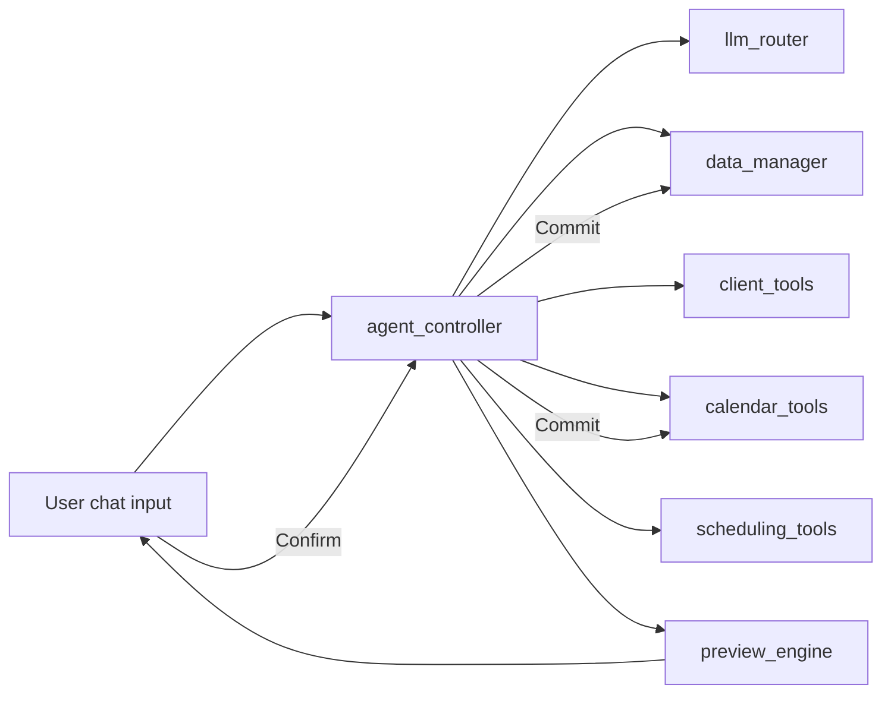

# Data-Aware AI Agent Upgrade — Implementation Plan

## Current State Summary

- **[app.py](app.py)**: Loads `recommendationOutput.xlsx` (as `df`) and `reminders.xlsx` (as `reminders_df`), builds calendar events from both; sidebar "Natural language overrides" uses [llm_parser.parse_instructions](llm_parser.py) → [rules.apply_actions](rules.py) and `apply_reminder_rules`; Commit to Excel for recommendations; calendar uses `streamlit_calendar`, click-to-show client detail and AI plan from [client_plan_llm](client_plan_llm.py).
- **[client_plan_llm.py](client_plan_llm.py)** and **[llm_parser.py](llm_parser.py)** already implement Gemini-first + Ollama fallback; [rules.py](rules.py) applies recommendation and (via app) reminder rules.

## Target Architecture

- **Preview-only rule**: No module writes to `recommendationOutput.xlsx` or `reminders.xlsx` until the user confirms in the UI. The agent produces a **plan** (structured list of actions); [preview_engine](preview_engine.py) turns that into `events_to_create`, `events_to_modify`, `events_to_delete` (and any recommendation edits) for display only.

---

## 1. llm_router.py (new)

- **Purpose**: Single entry point for LLM calls; Gemini 2.5 Flash first, Ollama fallback.
- **API**: `ask_llm(prompt: str) -> str`.
- **Implementation**: Reuse the pattern from [client_plan_llm.py](client_plan_llm.py) (`_call_gemini` / `_call_ollama`): same env vars (`GEMINI_API_KEY`, `GEMINI_MODEL`, `OLLAMA_URL`, `OLLAMA_MODEL`), same timeout/cleanup (strip code fences, empty handling). Call Gemini first; if it returns `None` or empty, call Ollama. Return combined string or a short fallback message on total failure.
- **Dependencies**: `google.generativeai`, `requests`, `python-dotenv` (already in [requirements.txt](requirements.txt)). No new deps.
- **Location**: Root only.

---

## 2. data_manager.py (new)

- **Purpose**: Central load/save for recommendation and reminder datasets; single source of column/schema usage for the agent.
- **APIs**:
  - `load_recommendations(path: str = "recommendationOutput.xlsx") -> pd.DataFrame`
  - `load_reminders(path: str = "reminders.xlsx") -> pd.DataFrame`
  - `get_client_dataframe() -> pd.DataFrame` — returns the same as `load_recommendations()` (the “client” dataset has Client, Cluster, Recommended_ProductType, Client_Birthdate, etc.).
  - `save_recommendations(df: pd.DataFrame, path: str = "recommendationOutput.xlsx") -> str` — backup then write; return backup path (reuse logic from [rules.commit_to_excel](rules.py)).
  - `save_reminders(df: pd.DataFrame, path: str = "reminders.xlsx") -> str` — backup then write; return backup path (reuse [app.py commit_reminders_to_excel](app.py) logic).
- **Implementation**: Use pandas `read_excel` / `to_excel`; for recommendations, replicate the column normalization and `EventDate` handling from [app.py load_recos](app.py) (lines 21–63) so the rest of the app and agent see the same schema. For reminders, ensure columns `ReminderId`, `Date`, `Subject`, `Content`; `Date` as datetime. No Streamlit cache here (app can keep its own cache or call data_manager at session start).
- **Column awareness**: Docstring (and optionally a small `get_recommendation_schema()` / `get_reminder_schema()` returning column names) so the agent can “dynamically reason about dataset columns” via prompts that include these schemas.

---

## 3. client_tools.py (new)

- **Purpose**: Read-only and derived-data operations on the recommendation (client) dataframe.
- **Input**: All functions take the dataframe from `data_manager.get_client_dataframe()` (or an explicit `df` argument) so the agent passes the same data it was given).
- **Functions** (all operate on pandas; type hints + docstrings):
  - `get_top_clients(n: int, df: pd.DataFrame, sort_by: str = "Total_Transactions") -> pd.DataFrame` — sort by `sort_by` (e.g. `Total_Transactions`, `Recommended_Amount_P50`, `Total_Invested_SGD`) and return top `n`; handle missing columns gracefully.
  - `filter_clients_by_product(product_type: str, df: pd.DataFrame) -> pd.DataFrame` — filter `Recommended_ProductType` (or `Current_ProductType`) to match `product_type` (case-insensitive strip).
  - `get_client_summary(client: str, df: pd.DataFrame) -> dict | None` — one row or first match for `Client == client`; return key fields (Client, Cluster, Recommended_ProductType, Recommended_Amount_P50, Client_Birthdate, etc.) as a dict.
  - `get_birthdays(df: pd.DataFrame, year: int | None = None) -> pd.DataFrame` — parse `Client_Birthdate` (e.g. DD/MM or DD/MM/YYYY), optionally filter to a given year; return rows with client and resolved birth date.
  - `get_high_value_clients(df: pd.DataFrame, min_amount: float | None = None, top_n: int | None = None) -> pd.DataFrame` — filter/sort by `Recommended_Amount_P50` or `Total_Invested_SGD`; support threshold and/or top N.
- **Implementation**: Use only pandas; no file I/O. Handle missing columns by returning empty DataFrame or default values as appropriate.

---

## 4. calendar_tools.py (new)

- **Purpose**: Get events from reminders and create/update/delete reminder rows; persistence to `reminders.xlsx` only when explicitly saving (used at **commit** time, not during plan generation).
- **APIs**:
  - `get_events(reminders_df: pd.DataFrame, start_date: date | None = None, end_date: date | None = None) -> list[dict]` — return list of events (e.g. `{ "id", "date", "subject", "content" }`) from the dataframe, optionally filtered by date range.
  - `create_event(client: str, date: date | datetime, title: str, amount: float | None = None, reminders_df: pd.DataFrame | None = None) -> dict` — build new reminder row (ReminderId, Date, Subject, Content); if `reminders_df` is provided, append in-memory and return the new row (caller persists); otherwise return the row dict for preview only. Content can include client and amount.
  - `update_event(event_id: str, fields: dict, reminders_df: pd.DataFrame) -> pd.DataFrame` — find row by `ReminderId == event_id`, apply `fields` (Date, Subject, Content), return modified dataframe (caller saves).
  - `delete_event(event_id: str, reminders_df: pd.DataFrame) -> pd.DataFrame` — drop row(s) with that ReminderId, return new dataframe.
- **Persistence**: Provide a thin wrapper that calls `data_manager.save_reminders(df)` after mutating the dataframe, or have app/agent_controller call `data_manager.save_reminders(calendar_tools.delete_event(...))` so that all file writes go through [data_manager](data_manager.py). ReminderId format can follow existing: `R-{timestamp}-{seq}`.

---

## 5. scheduling_tools.py (new)

- **Purpose**: Date/scheduling helpers used by the agent to plan when to place events (no direct file writes).
- **APIs**:
  - `schedule_evenly(clients: list[str], start_date: date, end_date: date) -> list[tuple[str, date]]` — distribute clients across weekdays in [start_date, end_date] (e.g. one client per day); return list of (client, date).
  - `avoid_weekends(dates: list[date]) -> list[date]` — filter out Saturday/Sunday.
  - `spread_events(dates: list[date], n: int) -> list[date]` — pick `n` dates spread across the list (e.g. for “second week of July except Wednesday” the agent would first compute the date list, then call this if needed).
- **Implementation**: Use `datetime`/`date` and list comprehensions; no pandas required inside this module. Optional: accept an “exclude weekdays” (e.g. exclude Wednesday) for queries like “second week of July leaving Wednesday”.

---

## 6. agent_controller.py (new)

- **Purpose**: Central “brain” that receives the user query, inspects schema, reasons via LLM, selects tools, and produces an **execution plan** (preview-only; no writes).
- **Flow**:
  1. Receive `user_query: str`.
  2. Load current data via `data_manager`: `get_client_dataframe()`, `load_reminders()` (or get from caller so app can pass session state).
  3. Build a **schema summary** (column names and types or sample) for recommendations and reminders (from data_manager / docstrings).
  4. Call `llm_router.ask_llm(...)` with a **system-style prompt** that includes: (a) role (data-aware calendar and recommendation agent), (b) dataset schemas, (c) list of available tools and their signatures/descriptions, (d) user query. Ask the LLM to output a **structured plan** (strict JSON): e.g. `{ "reasoning": "...", "steps": [ ... ], "events_to_create": [ { "client", "date", "title", "amount?" } ], "events_to_modify": [ { "id", "fields" } ], "events_to_delete": [ "id", ... ], "recommendation_changes": [ { "client", "field", "value" } ] }`.
  5. Parse JSON from LLM response (with fallback/retry or validation); return a **plan** dict. Do **not** call any tool that writes to disk; only read-only tools (e.g. get_top_clients, filter_clients_by_product, get_birthdays) may be invoked **inside** the controller to feed the LLM (e.g. “here are the top 3 stock clients”) so the model can fill in concrete client IDs and dates in the plan.
- **Design choice**: Prefer **one or two LLM rounds**: (1) optional: “Given this query and schema, which tools would you use and what parameters?” → run read-only tools → (2) “Given these tool results, produce the full execution plan (JSON).” Alternatively, a single prompt that describes the data (and optionally pre-computed tool results) and asks for the full plan in one shot. Single-shot is simpler and sufficient for the required examples.
- **Output**: Return a **plan** object (dict) that [preview_engine](preview_engine.py) and the app can consume.

---

## 7. preview_engine.py (new)

- **Purpose**: Simulate the agent’s plan and produce the three lists for UI display **without** modifying any file.
- **API**: e.g. `simulate(plan: dict, reminders_df: pd.DataFrame, recommendations_df: pd.DataFrame) -> dict` returning `{ "events_to_create": [ ... ], "events_to_modify": [ ... ], "events_to_delete": [ ... ], "recommendation_changes": [ ... ] }`.
- **Implementation**: Interpret `plan["events_to_create"]` (and _modify, *delete, recommendation_changes); for creates, build the would-be row (ReminderId can be a placeholder like `preview-{i}`); for modifies/deletes, resolve by id and show before/after or list of ids; for recommendation_changes, show client, field, old value, new value (by reading from `recommendations_df`). No calls to `data_manager.save`** or `calendar_tools` write paths.

---

## 8. app.py modifications

- **Preserve**: All existing behavior — sidebar (Parse / Apply / Commit to Excel), filters, calendar, click-on-date client detail, market outlook, future plan (client_plan_llm), reminder delete button, and dataframe download.
- **Add**: A **chat section** (e.g. expander “AI Agent” or a top tab “Agent” vs “Calendar”):
  - Text input or `st.chat_input` for the user request.
  - On submit: call `agent_controller` with the query (pass current `df` and `reminders_df` from session state or reload via data_manager). Receive plan.
  - Call `preview_engine.simulate(plan, reminders_df, df)` and show the result: `events_to_create`, `events_to_modify`, `events_to_delete`, and any `recommendation_changes` in readable format (tables or lists).
  - “Confirm” button: only when confirmed, apply the plan — for events: apply creates/updates/deletes to `reminders_df` and call `data_manager.save_reminders()`; for recommendation changes: apply edits to `df` (e.g. amount_set for “change recommended amount for B56 to 12000”) and call `data_manager.save_recommendations()`. Then update session state (`reminders_df`, `applied_df` if needed) and rerun.
- **Integration**: Use `data_manager.load_reminders` / `load_recommendations` where it replaces duplicate logic (optional refactor of `load_recos`/`load_reminders` to delegate to data_manager) so the calendar and agent share the same data source. Ensure `st.session_state["reminders_df"]` and any `applied_df` stay in sync after agent commit.

---

## 9. Compatibility and Conventions

- **Existing functionality**: Keep `parse_instructions`, `apply_actions`, `apply_reminder_rules`, `commit_to_excel` (rules), and `commit_reminders_to_excel` (or replace the latter with `data_manager.save_reminders` under the hood). Calendar events still built from `df` (EventDate, Cluster, Client) and `reminders_df` (ReminderId, Date, Subject, Content).
- **Pandas only** for data manipulation; no nested folders; all new modules in project root.
- **Type hints and docstrings** in all new modules; minimal duplication (shared env and backup logic in data_manager).

---

## 10. Example Queries (in comments)

Add to **agent_controller.py** or a dedicated comment block (e.g. at top of [agent_controller.py](agent_controller.py)) showing how the agent handles:

1. **“Schedule meetings with top 3 stock clients tomorrow”**
  Use `get_top_clients(3)` on dataframe filtered by `filter_clients_by_product("STOCK")`; resolve “tomorrow”; plan `events_to_create` with one event per client and date = tomorrow.
2. **“Wish ETF clients on their birthdays this year”**
  Use `filter_clients_by_product("ETF")` and `get_birthdays(df, year=current_year)`; plan `events_to_create` for each (client, birthday_date) with title like “Birthday wish – {client}”.
3. **“Remove all meetings on Mondays”**
  Use `get_events(reminders_df)`; filter events where `date.weekday() == 0`; plan `events_to_delete` with those ReminderIds.
4. **“Add entries for client B10 during second week of July except Wednesday”**
  Compute date range (second week of July), exclude Wednesday; use `scheduling_tools.avoid_weekends` and a custom “exclude weekday”; plan `events_to_create` for B10 for each of those dates.
5. **“Change the recommended amount for B56 to 12000”**
  Plan `recommendation_changes`: client B56, field `Recommended_Amount_P50` (or P10/P90 as needed), value 12000; on commit, apply via rules-style amount_set or direct dataframe update and `save_recommendations`.

---

## File Summary

| File                  | Action                                                                                                     |
| --------------------- | ---------------------------------------------------------------------------------------------------------- |
| `llm_router.py`       | New: `ask_llm(prompt) -> str`, Gemini then Ollama                                                          |
| `data_manager.py`     | New: load/save recommendations and reminders, `get_client_dataframe()`                                     |
| `client_tools.py`     | New: get_top_clients, filter_clients_by_product, get_client_summary, get_birthdays, get_high_value_clients |
| `calendar_tools.py`   | New: get_events, create_event, update_event, delete_event (persist via data_manager on commit)             |
| `scheduling_tools.py` | New: schedule_evenly, avoid_weekends, spread_events                                                        |
| `agent_controller.py` | New: receive query, schema + LLM, produce plan (no writes)                                                 |
| `preview_engine.py`   | New: simulate(plan) → events_to_create/modify/delete + recommendation_changes                              |
| `app.py`              | Add chat UI → plan → preview → confirm → apply; optionally delegate load/save to data_manager              |

No changes to **rules.py**, **llm_parser.py**, or **client_plan_llm.py** except possibly switching to a shared `llm_router.ask_llm` later (optional). **requirements.txt** already has the needed dependencies.